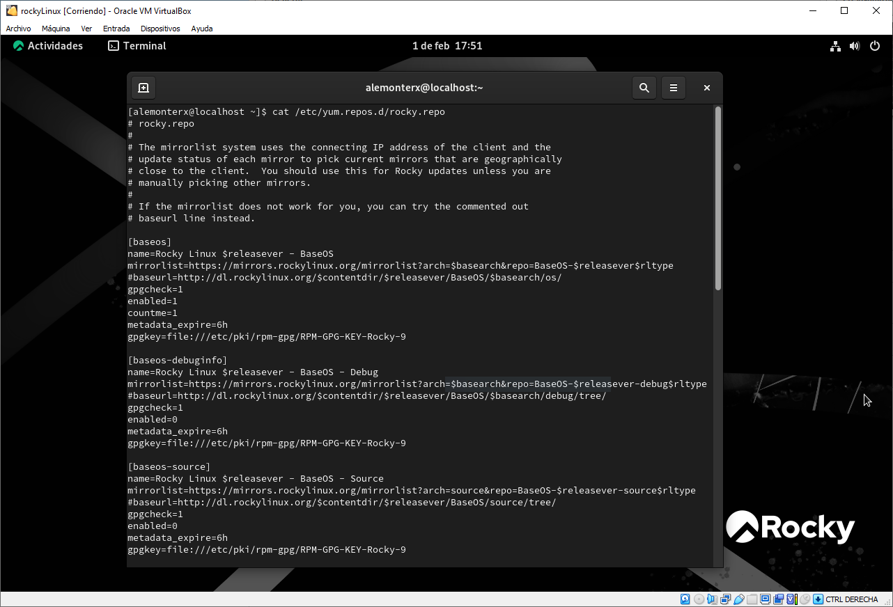

# REPOSITORIOS EN ROCKY LINUX


## ¿Dónde se encuentran?

Para visualizar los repositorios por defecto que nos trae Rocky Linux debemos de fijarnos en el directorio `/etc/yum.repos.d/`. Este contiene diferentes archivos que hacen referencia a cada repositorio que hay configurado en el sistema.

Para visualizar específicamente los repositorios de Rocky Linux ejecutaremos el siguiente comando:

```bash
cat /etc/yum.repos.d/rocky.repo
```


